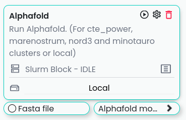
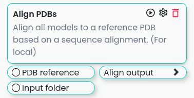
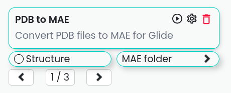
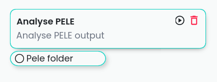

************
Blocks
************

Blocks of the tools developed or used in the EAPM academic group, the Victor Guallar's lab of Electronic and Atomic Protein Modelling at the Barcelona Supercomputing Center.
This repository contains a collection of plugins developed by the EAPM Group for use with Horus App.

All the Blocks are intended for Enzyme-Engineering applications.

Previous configurations
=======================

Remotes configurations for Horus App:
-------------------------------------

When you open Horus, you will be greeted by the initial menu. From here, you can establish a new remote by selecting the "Remotes"
option (highlighted in blue) and then clicking on "New Remote" located in the top right corner.

.. image:: imgs/home2.png
    :width: 600
    :align: center
    :alt: Horus Home

This action will prompt a form to appear, allowing you to input the necessary configurations for establishing a connection with the remote device.

Once all configurations are properly set, the remote will appear in the drop-down menu within the Slurms blocks interface.

.. image:: imgs/blockRemotes.png
    :width: 250
    :align: center
    :alt: Horus remote in plugin

The Slurm blocks will contain a standard additional configuration to define certain parameters required for the Slurm manager in HPC environments.

.. image:: imgs/slurmConfig.png
    :width: 400
    :align: center
    :alt: Horus block slurm configuration

List of the blocks
===================

There is the list of the blocks available in this repository:

- :ref:`Alphafold <alphafold>`
- :ref:`PrepWizard <prepwizard>`
- :ref:`Align PDBs <align_pdbs>`
- :ref:`Setup Docking Grid (with glide) <setup_docking_grid>`
- :ref:`Run Glide Docking <run_glide_docking>`
- :ref:`Analyse Glide Docking <analyse_glide_docking>`
- :ref:`PDB to MAE <pdb_to_mae>`
- :ref:`Trim Alphafold models <trim_alphafold_models>`
- :ref:`PELE <pele>`
- :ref:`Analyse PELE <analyse_pele>`
- :ref:`Conserved Residues from MSA <conserved_residues_msa>`
- :ref:`Multiple Sequence Alignment with Mafft <msa_mafft>`
- :ref:`HmmBuild <hmmbuild>`
- :ref:`HmmSearch <hmmsearch>`
- :ref:`AsiteDesign <asite_design>`

.. _alphafold:

Alphafold
---------

Flow for executing the alphafold block, can run locally and in the clusters cte_power, marenostrum, minotauro, and nord3.

*Input*:

- ``fasta``: Fasta file with the sequence of the proteins to model.

*Output*:

- ``output``: Folder with the output of the Alphafold model.

*Parameters*:

- ``folder name``: Name of the folder where the output will be saved.
- ``remove``: Remove the folder with the output of the Alphafold model. For restarting porpoises.

.. _prepwizard:

PrepWizard
----------

.. warning::
    Need a Schrödinger Prime license to run this block.

PrepWizard is a tool for preparing protein structures for molecular simulations. It is used to add hydrogens, assign bond orders, and optimize the geometry of the protein structure.

.. image:: imgs/prepWizard.png
    :width: 350
    :align: center
    :alt: Horus PrepWizard block

*Input*:

- ``input``: Folder with the PDBs to be processed with the Preparation Wizard.

*Output*:

- ``output``: Folder with the processed PDBs.

*Parameters*:

- ``folder name``: Name of the folder where the output will be saved.
- ``PH``: PH to use for the preparation.
- ``Epik PH``: PH to use for the Epik tool.
- ``Sample water``: Sample water molecules in the structure.
- ``Remove Hydrogens``: Remove hydrogens from the structure.
- ``Delete Water Hbond Cut-off``: Distance to delete water molecules.
- ``Fill loops``: Fill loops in the structure.
- ``Protonation States``: Protonation states to use in the structure.
- ``No Epik``: Do not use Epik in the preparation.
- ``No Prot Assign``: Do not use ProtAssign in the preparation.

.. _align_pdbs:

Align PDBs
----------

.. warning::
    Need a mafft installation.

Align PDBs is a tool for aligning protein structures. It is used to align the structures of the proteins to compare them.

*Input*:

- ``PDB reference``: PDB file with the reference structure.
- ``Input folder``: Folder with the PDBs to be aligned.

*Output*:

- ``Align output``: Folder with the processed PDBs.

*Parameters*:

- ``Chain indexex``: Chain indexes to use in the alignment. Use this option when the trajectories have corresponding chains in their topologies.
- ``Trajectory chain indexes``: Chain indexes of the target trajectories to use in the alignment.
- ``Alignment mode``: The mode defines how sequences are aligned. 'exact' for structurally aligning positions with exactly the same aminoacids after the sequence alignment or 'aligned' for structurally aligning sequences using all positions aligned in the sequence alignment.
- ``Reference residues``: Reference residues to use in the alignment.

.. _setup_docking_grid:

Setup Docking Grid
------------------

.. warning::
    Need a Schrödinger Glide license to run this block.

Setup Docking Grid is a tool for setting up the docking grid for Glide. It is used to prepare the grid for the docking of the ligands.

*Input*:

- ``Model folder``: Folder with the models to be used in the docking.
- ``Ligand folder``: Folder with the ligands to be docked.
- ``Outer box size``: Size of the outer box.
- ``Inner box size``: Size of the inner box.

*Output*:

- ``Grid``: Folder with the grid files.

*Parameters*:

- None

.. _run_glide_docking:

Run Glide
---------

.. warning::
    Need a Schrödinger Glide license to run this block.

Run Glide is a tool for running the Glide docking. It is used to dock the ligands to the protein.

.. note::
    This block is intended to be used after the Setup Docking Grid block.

.. image:: imgs/glide.png
    :width: 350
    :align: center
    :alt: Horus Run Glide block

*Input*:

- ``Model folder``: Folder with the models to be used in the docking.
- ``Ligand folder``: Folder with the ligands to be docked.

or

- ``Grid``: Folder with the grid files.

*Output*:

- ``Output poses``: Folder with the poses of the model and ligand.

*Parameters*:

- ``Poses per ligand``: Number of poses to generate per ligand.

.. _analyse_glide_docking:

Analyse Glide Docking
---------------------

.. warning::
    Need a Schrödinger Glide license to run this block.

Analyse Glide Docking is a tool for analysing the results of the Glide docking. The function allows to calculation of ligand 
distances with the options protein_atoms or protein_pairs. With the first option, the analysis will calculate the closest distance 
between the protein atoms given and any ligand atom (or heavy atom if ignore_hydrogens=True). The analysis will also return which ligand 
atom is the closest for each pose. On the other hand, with the atom_pairs option only distances for the specific atom pairs between 
the protein and the ligand will be calculated.

.. image:: imgs/analysisDocking.png
    :width: 350
    :align: center
    :alt: Horus Analyse Glide Docking block

*Input*:

- ``Model folder``: Folder with the models to be used in the docking.
- ``Docking folder``: Folder with the docking results.

or

- ``Glide output``: Folder with the docking results.

*Output*:

- ``Output poses``: Folder with the poses of the model and ligand.
- ``Glide results output``: Folder with the results of the analysis.

*Parameters*:

- ``Ligand separator``: Separator used to separate the ligand name from the docking pose.
- ``Max threshold``: Maximum threshold to consider a pose as a good pose.
- ``Poses folder name``: Name of the folder where the poses will be saved.
- ``Selections``: List of selections to analyse.

.. _pdb_to_mae:

PDB to MAE
----------

.. warning::
    Need a Schrödinger Maestro to run this block.

PDB to MAE is a tool for converting PDB files to MAE files. It is used to convert the PDB files to the format used by Schrödinger.

*Input*:

- ``Structure``: Loaded molstar structure.

or

- ``PDB file``: PDB to be converted.

or

- ``PDB folder``: Folder with the PDBs to be converted.

*Output*:

- ``Mae folder``: Folder with the MAE files.

*Parameters*:

- ``Change ligand name``: Change the ligand name inside the PDB. This will replace the chain, residue and atom names with the ligand name (L).

.. _trim_alphafold_models:

Trim Alphafold models
---------------------

Trim Alphafold models is a tool for trimming the Alphafold models. It is used to trim the models to the desired length.

*Input*:

- ``Models``: Folder with the models to be trimmed.

*Output*:

- ``First PDB``: PDB of the first trimmed model.
- ``Trimmed models``: Folder with the trimmed models.

*Parameters*:

- ``Confidence threshold``: Threshold confidence indicates the maximum confidence score at which to stop the trimming of terminal regions.

.. _pele:

PELE
----

PELE is a tool for running PELE simulations. 

.. image:: imgs/pele.png
    :width: 350
    :align: center
    :alt: Horus PELE block

*Input*:

- ``Model folder``: Folder with the PDBs files for the PELE simulation.
- ``PELE folder``: Folder with the PDBs models with the docked ligand.
- ``PELE yaml``: PELE yaml file with the configuration of the simulation.

*Output*:

- ``PELE output``: Folder with the PELE output.

*Parameters*:

- ``PELE folder name``: Name of the folder where the PELE output will be saved.
- ``Selections``: List of selections to analyse.
- ``Box centers``: Box centers for the PELE simulation.
- ``Box radius``: Box radius for the PELE simulation.
- ``Constraints``: List of the constraints for the PELE simulation. **WIP**.
- ``Ligand index``: Index of the ligand in the PDB file.
- ``PELE steps``: Number of steps for the PELE simulation.
- ``PELE debug``: Debug mode for the PELE simulation.
- ``PELE iterations``: Number of iterations for the PELE simulation.
- ``Equilibration steps``: Number of equilibration steps for the PELE simulation.
- ``Ligand energy groups``: Energy groups for the ligand in the PELE simulation. **WIP**.
- ``PELE separator``: Separator used to separate the ligand name from the docking pose.
- ``Use PELEffy``: Use PELEffy to generate the ligand parameters.
- ``Use srun``: Use srun to launch the PELE simulation.
- ``Energy by residue``: Calculate the energy by residue in the PELE simulation.
- ``EBR new flag``: New flag for the energy by residue calculation.
- ``90 degrees version``: Use the 90 degrees version of the PELE simulation.
- ``Analysis``: Analysis to perform in the PELE simulation.
- ``Energy by residue type``: Type of energy by residue calculation.
- ``Peptide``: Peptide to use in the PELE simulation.
- ``Equilibration mode``: Equilibration mode to use in the PELE simulation.
- ``Spawning``: Spawning to use in the PELE simulation.
- ``Continuation``: If is a continuation of a previous simulation.
- ``Equilibration``: If is an equilibration simulation.
- ``Skip models``: Write which models names to skip.
- ``Skip ligands``: Write which ligands names to skip.
- ``Extend iterations``: Extend the number of iterations in the PELE simulation.
- ``Only models``: Only run the PELE simulation for the models in the list.
- ``Only ligands``: Only run the PELE simulation for the ligands in the list.
- ``Only combinations``: Only run the PELE simulation for the combinations in the list.
- ``Ligand template``: Template to use for the ligand in the PELE simulation. **WIP**.
- ``Seed``: Seed to use in the PELE simulation.
- ``Log file``: Enable log file in the PELE simulation.
- ``Rescoring``: Rescoring to use in the PELE simulation.
- ``Epsilon``: Epsilon to use in the PELE simulation.
- ``Ligand equilibration cst``: Ligand equilibration constraints to use in the PELE simulation.
- ``Covalent setup``: Covalent setup to use in the PELE simulation.
- ``Nonbonded new flag``: Nonbonded new flag to use in the PELE simulation.
- ``Nonbonded energy``: Nonbonded energy to use in the PELE simulation.
- ``Covalent base AA``: Covalent base aminoacid to use in the PELE simulation.
- ``Membrane residues``: Membrane residues to use in the PELE simulation.
- ``Bias to point``: Bias to point to use in the PELE simulation.
- ``com bias1``: Bias to point to use in the PELE simulation.
- ``com bias2``: Bias to point to use in the PELE simulation.

.. _analyse_pele:

Analyse PELE
------------

Analyse PELE is a tool for analysing the results of the PELE simulations. 

*Input*:

- ``PELE folder``: Folder with the PELE simulation.

*Output*:

- None

*Parameters*:

- None

.. _conserved_residues_msa:

Conserved Residues from MSA
---------------------------

Conserved Residues from MSA is a tool for calculating the conserved residues from a Multiple Sequence Alignment.

.. image:: imgs/conserved.png
    :width: 350
    :align: center
    :alt: Horus Conserved Residues from MSA block

*Input*:

- ``Protein folder``: Folder with the models PDBs.

*Output*:

- ``Conserved residues``: Dictionary with the conserved residues between the residues.

*Parameters*:

- ``Residue index``: Index of the residues to get. If not set all the residues will be returned.

.. _msa_mafft:

Multiple Sequence Alignment with Mafft
--------------------------------------

Multiple Sequence Alignment with Mafft is a tool for aligning multiple sequences.

.. image:: imgs/msa.png
    :width: 350
    :align: center
    :alt: Horus MSA block

*Input*:

- ``Protein folder``: Folder with the models PDBs.

*Output*:

- ``MSA File``: File with the multiple sequence alignment.

*Parameters*:

- None

.. _hmmbuild:

HmmBuild
--------

HmmerBuild creates a position-specific scoring table, called a profile hidden Markov model (HMM), that is a statistical model of 
the consensus of a multiple sequence alignment.

.. image:: imgs/hmmBuild.png
    :width: 350
    :align: center
    :alt: Horus HmmBuild block

*Input*:

- ``MSA File``: File with the multiple sequence alignment.

*Output*:

- ``Output HMM``: File with the Hidden Markov Model.

*Parameters*:

- None

.. _hmmsearch:

HmmSearch
---------

HmmSearch is a tool for searching a Hidden Markov Model in a database.

*Input*:

- ``HMM Input``: File with the Hidden Markov Model.

*Output*:

- ``Output``: Folder with the output of the search.

*Parameters*:

- ``Sequence DB``: Database to search the HMM.
- ``Hmmsearch evalue``: E-value to use in the search.

.. _asite_design:

AsiteDesign
-----------

AsiteDesign is a tool for designing the active site of a protein.

.. image:: imgs/asiteDesign.png
    :width: 350
    :align: center
    :alt: Horus AsiteDesign block

*Input*:

- ``Input yaml``: File with the configuration of the design.
- ``Input PDB``: PDB file with the protein to design.
- ``Parameters``: Folder with the parameters files.

*Output*:

- ``Asite simulation folder``: Folder with the output of the design.

*Parameters*:

- ``Container``: If you are launching the block in a container. The container to use.