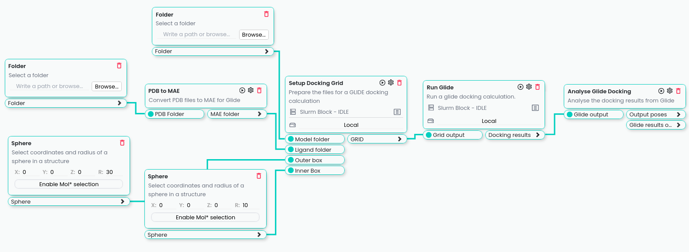
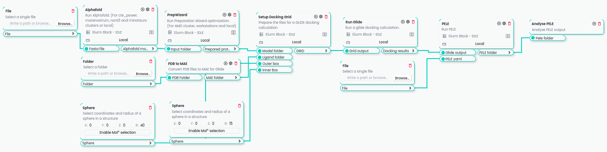

************
Flows
************

Glide Docking
-------------

.. warning::
    Need a Schrödinger Glide license to run this block.

Flow for executing a Glide docking, starting with a docking grid calculation followed by the execution of the glide docking 
and finally an analysis of the docking results.

Alphafold, PrepWizard, Glide and PELE
-------------------------------------

.. warning::
    Need a Schrödinger Glide license to run this block.

Flow for generating the 3D structure of a protein with Alphafold, followed by a protein preparation with PrepWizard, a Glide docking and a PELE simulation.

